# Przychodnia - Medical Clinic Management System

An application built with JavaFX and PostgreSQL enables management of patient-doctor relationships, appointment scheduling, prescription handling to patient, and patient medical informations storing and editing by its doctors.

## Features

- **Patient & Doctor Management** - Registration and profile management for both patient and doctor
- **Appointment Scheduling** - Book, view, and manage medical appointments
- **Prescription System** - Create and track prescriptions with medications management
- **Medical Informations** - Maintain patient current medical informations including diseases, allergies, and examinations
- **Specialization Management** - Doctors can add and manage their medical specializations
- **Secure Authentication** - Separate login systems for patients and medical staff

## Technology Stack

- **Frontend**: JavaFX
- **Backend**: Java
- **Database**: PostgreSQL
- **Architecture**: MVC Pattern

## Database Schema - ERD
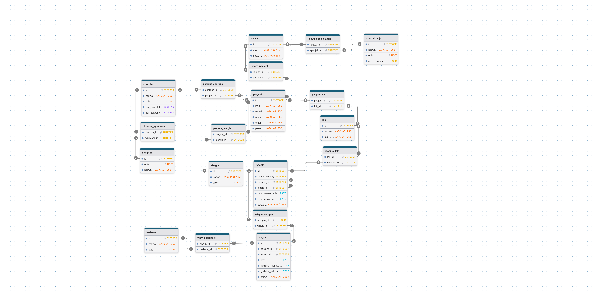

## Diagram DFD
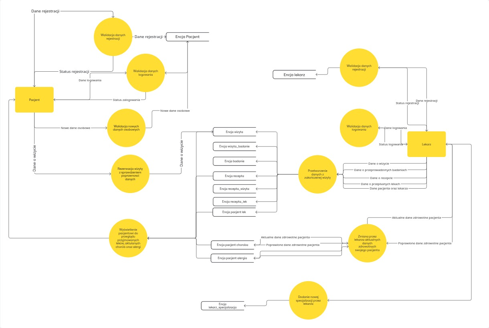

## UI Screenshots
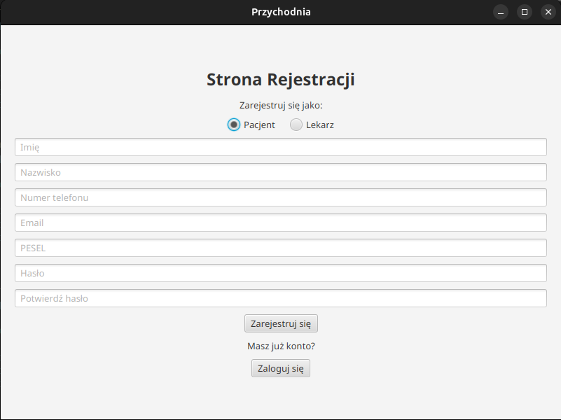
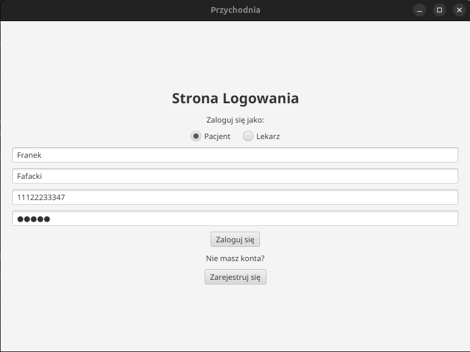
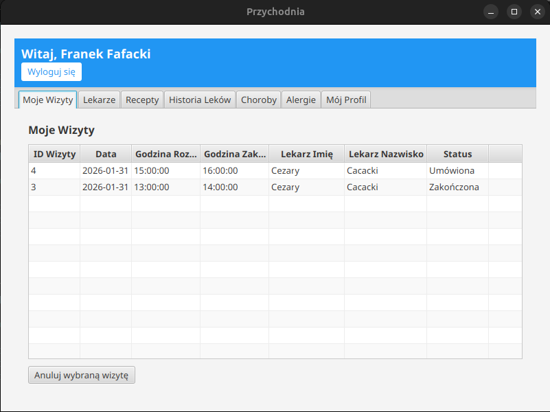
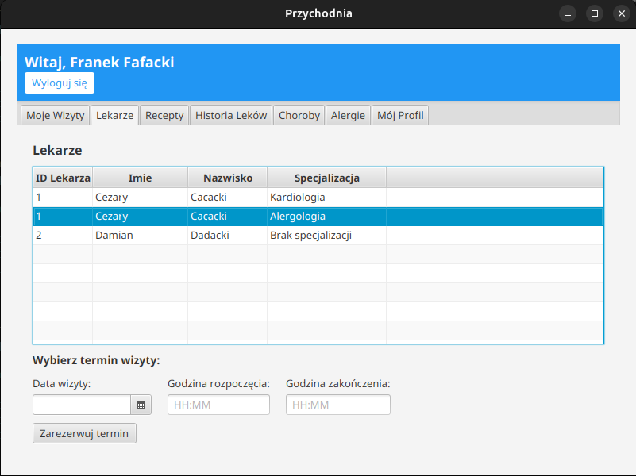
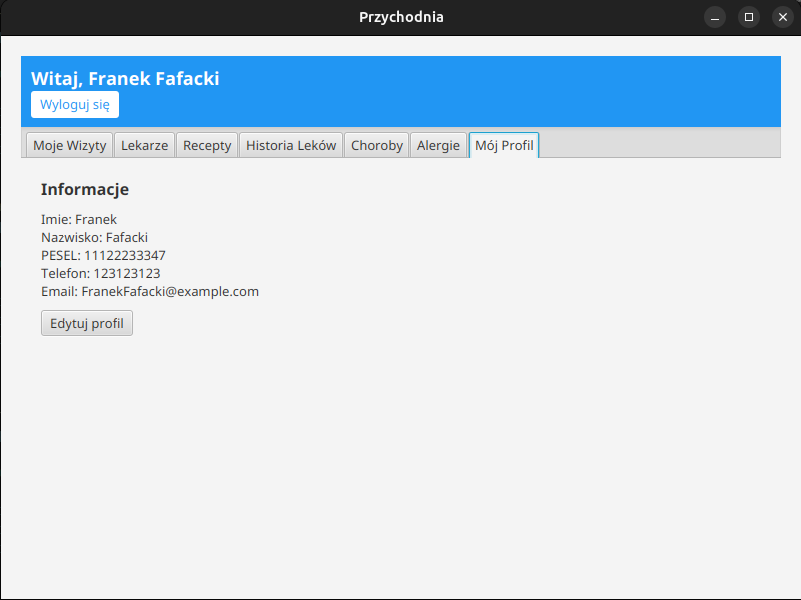
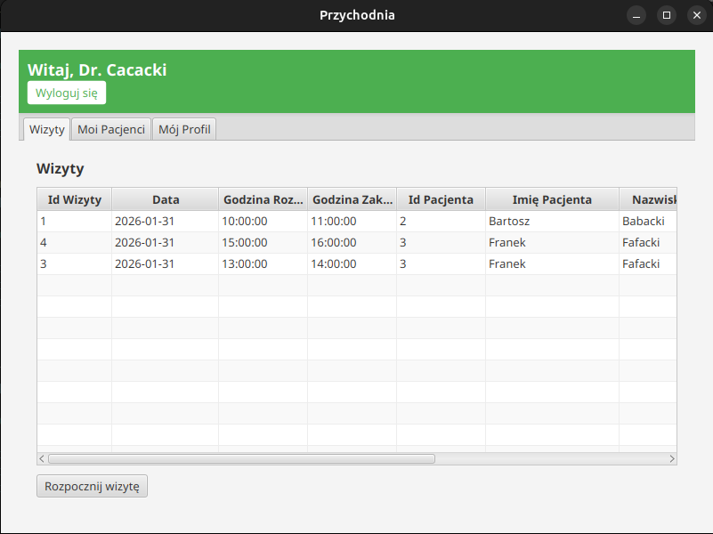
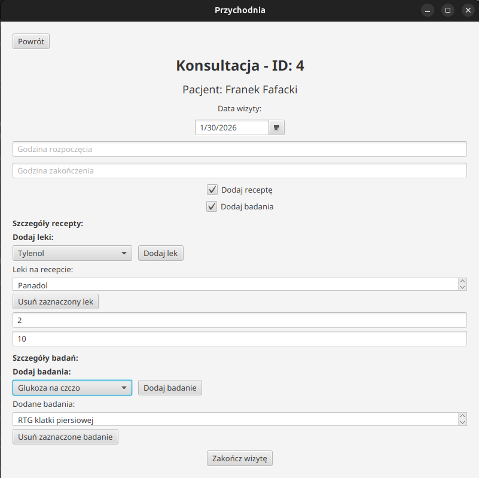
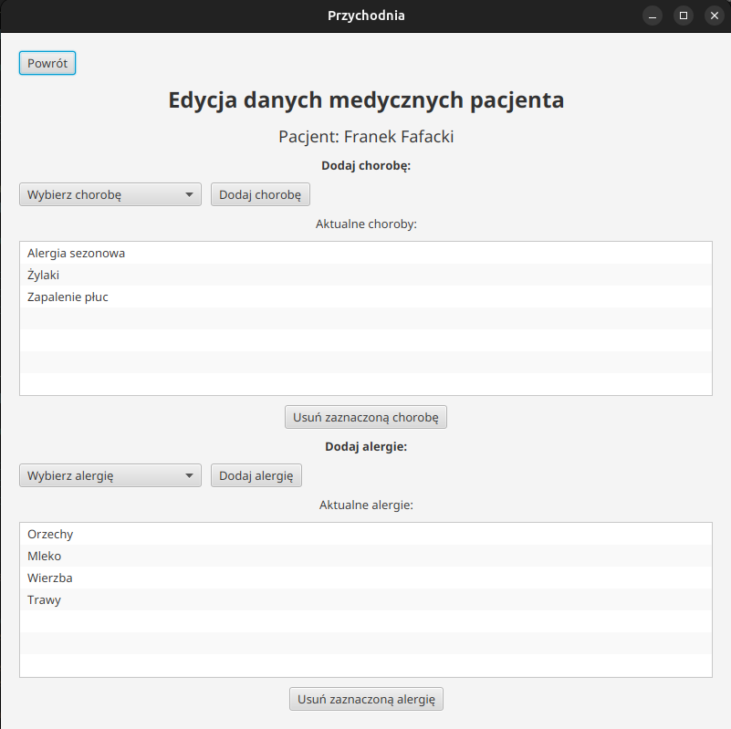
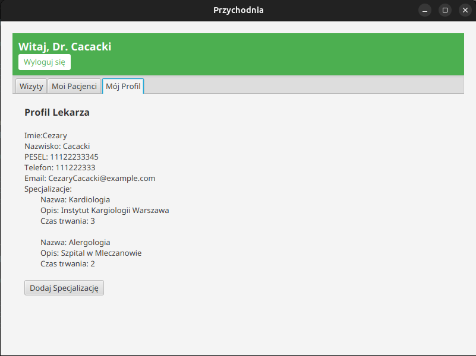
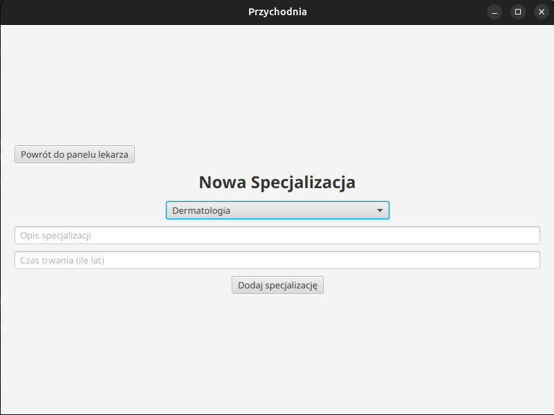

